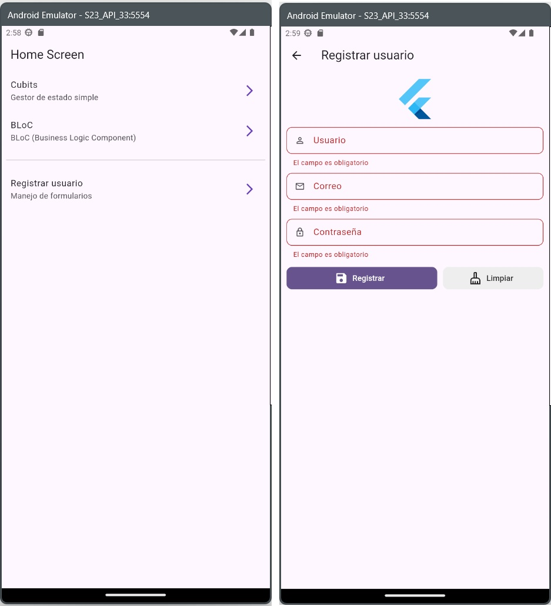

<!-- filepath: c:\Users\andres\Documents\Curso flutter\forms_app\README.md -->
# Forms App

Una aplicación Flutter que demuestra diferentes conceptos de gestión de estado y manejo de formularios.



## 📱 Características

- **Gestión de estado con Cubit**: Implementación de contador sencillo usando el patrón Cubit
- **Gestión de estado con BLoC**: Manejo de estado más complejo usando el patrón BLoC (Business Logic Component)
- **Gestión de formularios**: Formularios de registro con validación
- **Navegación**: Navegación entre pantallas usando go_router

## 🧰 Tecnologías utilizadas

- Flutter
- flutter_bloc (para Cubit y BLoC)
- equatable
- go_router
- form_validator

## 📂 Estructura del proyecto

```sh
lib/
  ├─ config/             # Configuraciones globales
  │   ├─ router/         # Configuración de rutas con go_router
  │   └─ theme/          # Temas de la aplicación
  │
  ├─ features/           # Características de la aplicación
  │   ├─ bloc_counter/   # Implementación de contador usando BLoC
  │   ├─ cubit_couter/   # Implementación de contador usando Cubit
  │   ├─ home/           # Pantalla principal
  │   └─ register/       # Formulario de registro
  │
  └─ shared/             # Componentes compartidos
      └─ widgets/        # Widgets reutilizables
```

## 🚀 Instrucciones de uso

1.**Instala las dependencias**:

```bash
flutter pub get
```

2.**Ejecuta la aplicación**:

```bash
flutter run
```

3.**Navegación por la aplicación**:

- La pantalla inicial muestra tres opciones principales:
  - **Cubits**: Ejemplo de gestión de estado simple
  - **BLoC**: Ejemplo de gestión de estado más compleja
  - **Registrar usuario**: Formulario con validación

4.**Experimenta con los contadores**:

- En las pantallas de Cubit y BLoC puedes:
  - Incrementar/decrementar el valor del contador
  - Resetear el contador
  - Observar cómo se mantiene el estado

5.**Prueba el formulario de registro**:

- Complete los campos con información válida
- Observe la validación en tiempo real
- Envíe el formulario cuando todos los campos sean válidos

## ⛑️ Ayuda

### 🗺️ Guías

**Comillas simples en vez de dobles:**

Abrir el archivo de `analysis_options.yaml` y establecer la siguiente configuración:

```yaml
include: package:flutter_lints/flutter.yaml

linter:
  rules:
    prefer_single_quotes: true # Aquí se habilita
```

Para aplicar y verificar:

```bash
# Analizar el código y ver los problemas encontrados por el linter
flutter analyze

# Corregir automáticamente las correcciones sugeridas (ej: Comillas simples por dobles)
dart fix --apply
```

### ⌨️ Comandos útiles

```bash
# Instalar los paquetes o dependencias
flutter pub get

# Compilar y ejecutar la aplicación en un dispositivo conectado o emulador
flutter run
```

```bash
# Limpiar temporales
flutter clean

# Ejecutar el doctor para validar si todo está correcto
flutter doctor
```
